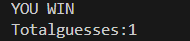
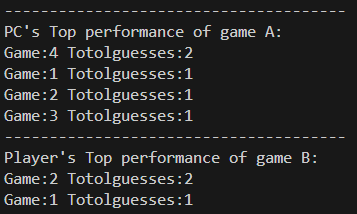
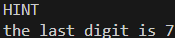
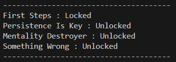

# 1A2B

**作者:413410036 方藝程。**

## 遊戲規則:

1. 出題者在腦子裡想一個數字(4位數且每位數都不一樣)。接者對方開始猜。
2. 若對方猜的數字是出題者腦海中4位數的其中一個且位置正確視為A。
3. 若對方猜的數字是出題者腦海中4位數的其中一個但位置不正確視為B。
4. 最後把A和B的個數加起來
Ex: 
    答案=0123，猜0243。0,3在答案中但是位置不正確所以A=2，2在答案裡面但位置不正確B=1。
    
一直猜到4A0B遊戲才會結束。

**(A)猜題者模式**

1. 遊戲開始玩家想一個四位數(個位數字不能重複)供電腦來進行猜測出。
2. 電腦會給出他的猜測且要求出題者給出xAyB。
3. 若玩家輸出4A0B 印出"PC WIN" 且結束遊戲，若使用者所輸入的A和B的數量加起來超過4出現負數或前後矛盾輸出"YOU CHEAT"且結束遊戲，否則回到2.。
```flow
  st=>start: 開始
  op1=>operation: 玩家想一個數字給程式猜
  op2=>output: 程式輸出一個4位數
  op3=>output: YOU CHEAT
  op4=>output: YOU WIN
  op5=>input: 玩家輸入xAyB
  cond1=>condition: if玩家輸入4A0B?
  cond2=>condition: ifx,y數量不輸入不當
  en=>end: 結束
  st->op1->op2->op5->cond1
  cond1(yes)->op4->en
  cond1(no)->cond2
  cond2(yes)->op3->en
  cond2(no)->op2
```
**(B)出題者模式**

1. 遊戲開始程式會隨機生成4個不重複的數字當作謎底，且猜題者不會知道
2. 程式會要求使用者輸入一個不重複的4位數，否則回到1.
3. 程式會回答xAyB
4. 若猜題者輸入與謎底相同程式則輸出"YOU WIN" 並結束，否則回到2.

```flow
  st=>start: 開始
  op1=>operation: 程式隨機生成謎底
  op2=>input: 玩家猜一個4位數
  op3=>output: 程式輸出xAyB
  op4=>output: YOU WIN
  cond1=>condition: if與謎底相同
  cond2=>condition: if輸入不當
  en=>end: 結束
  st->op1->op2->cond2
  cond1(yes)->op4->en
  cond1(no)->op3->op2
  cond2(yes)->op2
  cond2(no)->cond1
```


**使用說明**
1. 打開1A2B.exe檔，一開始程式會要求玩家輸入a,b,c
* a:(A)猜題者模式
* b:(B)出題者模式
* c:查看成就

2. 當一場遊戲運行完成後會要求玩家輸入1,2,3
* 1:在一場(回到1.)
* 2:結束程式
* 3:查看成就


**額外功能**
1. 計算電腦或玩家在gameA或gameB猜了幾次才答對

2. 排名系統 : 用猜的次數來進行排名

3. 提示 : 在gameB中輸入HINT可以看得到謎底的最後一位數字

4. 成就系統 : 共有4個成就分別是
* First Steps : 玩一場遊戲
* Persistence Is Key : 玩10場遊戲
* Mentality Destroyer : 得到5次YOU　CHEAT
* Something Wrong : 用5次HINT(一場最多一次)



